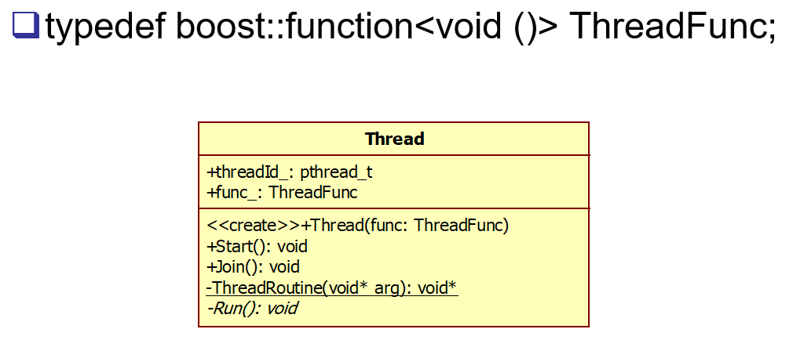
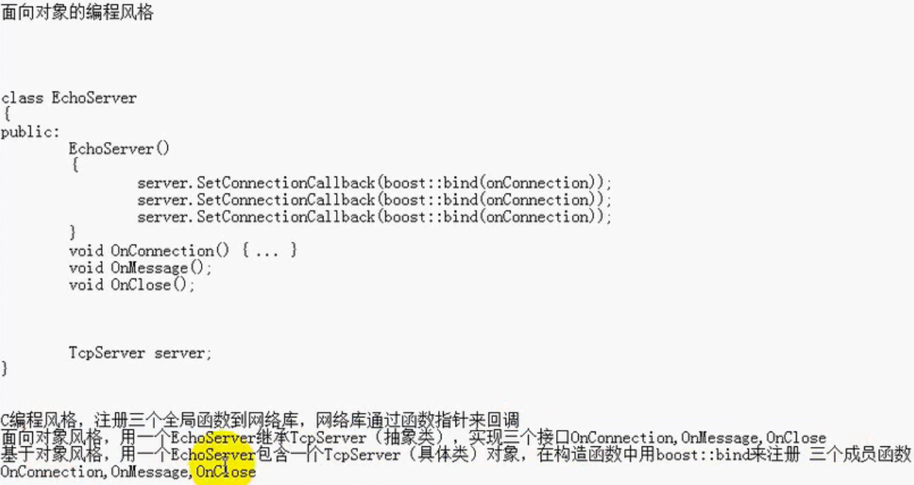

## 基于对象的编程风格
#### boost bind/function
 - `boost bind/function` 库的出现，替代了 `stl中的mem_fun,ptr_fun,bind1st,bin2nd` 等函数
 - 函数适配器 -> 从一种接口 适配为 另一种接口
 - 示例
    ```C++
    #include <iostream>
    #include <boost/function.hpp>
    #include <boost/bind.hpp>
    using namespace std;

    class Foo
    {
        public:
            void memberFunc(double d, int i, int j)
            {
                cout << d << endl;//打印0.5
                cout << i << endl;//打印100       
                cout << j << endl;//打印10
            }
    };
    int main()
    {
        Foo foo;
        boost::function<void (int)> fp = boost::bind(&Foo::memberFunc, &foo, 0.5, _1, 10);
        fp(100);
        return 0;
    }
    ```
## Thread 类图

 - 定义 Thread 具体类





