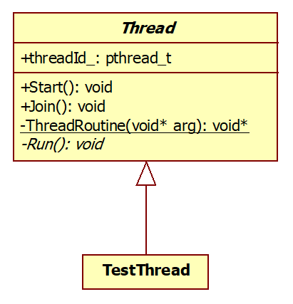

## 学习 C++
 - `https://www.runoob.com/cplusplus/cpp-inheritance.html`
 - `http://c.biancheng.net/view/269.html`

## 面向对象风格封装线程类

 - 抽象类 Thread 是不能够实例化对象的
 - 派生类 TestThread 是可以实例化对象的
 - 每一个线程类都有一个执行体，用 run 来表示，在 Thread 抽象类中表现为纯虚函数
 - 线程对象的声明周期 与 线程的声明周期 是不一样的，join 是销毁线程，但是线程对象销毁得等程序执行结束

## 运行代码
 - `./build.sh`