## 常见并发服务器方案
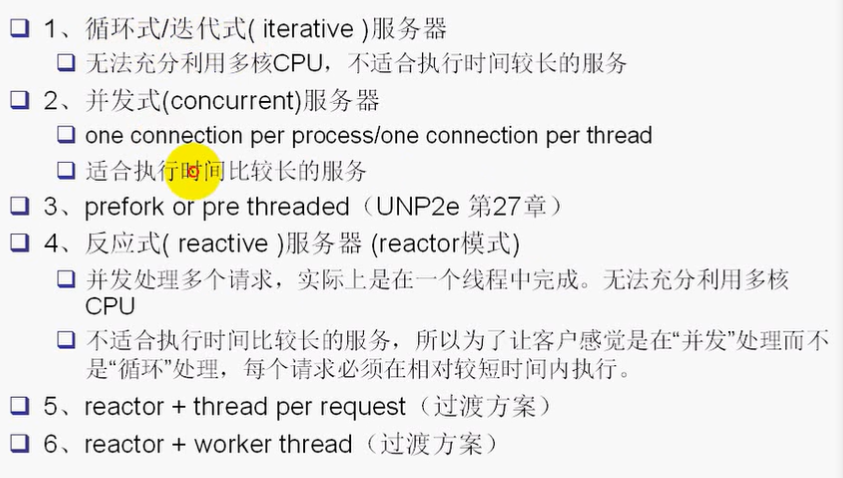
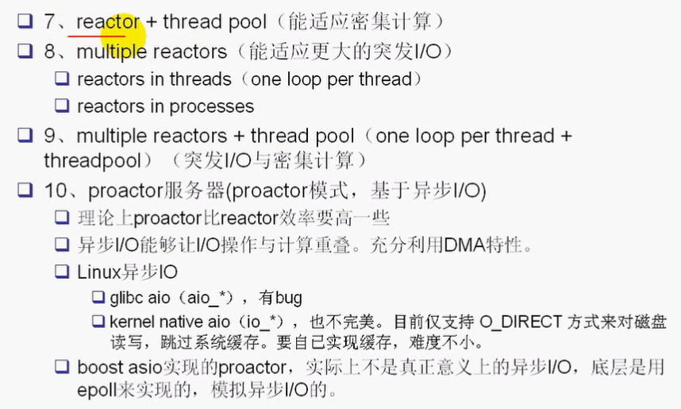

## 循环式/迭代式(iterative)服务器
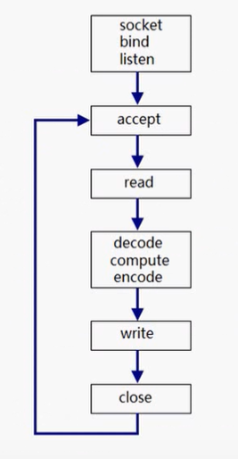

## 并发式(concurrent)服务器
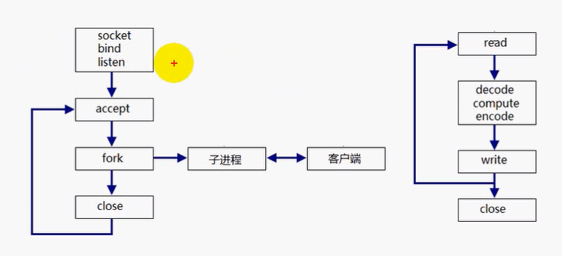

## prefork or pre threaded
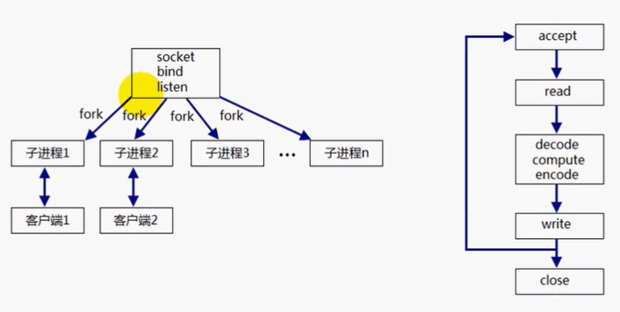

## 反应式服务器(reactor 模式)
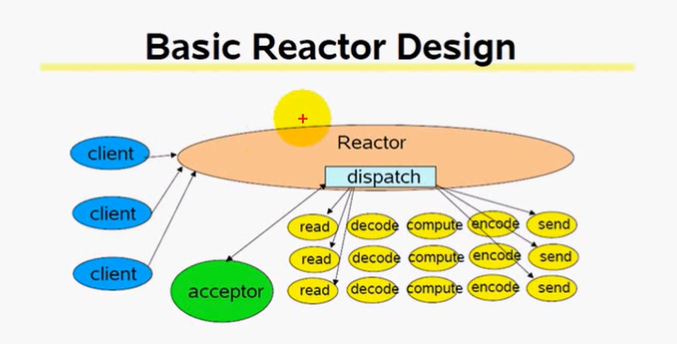

## reactor + thread per request

## reactor + worker thread
## reactor + threadpool（能适应密集计算）
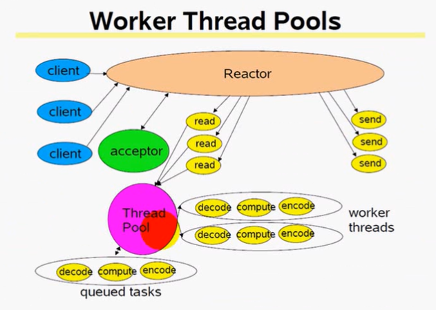

## multiple reactors（能适应更大的突发I/O）
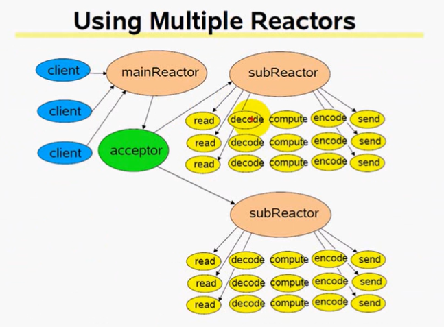

## multiple reactors + thread pool(one loop per tread + threadpool)（突发 I/O 与密集计算）❗
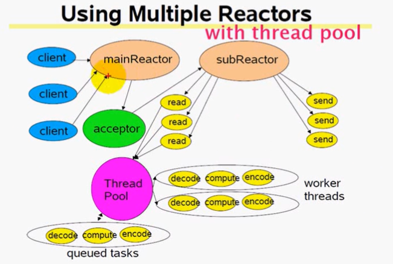

## proactor 服务器（proactor 模式，基于异步 I/O）

## 异步I/O
 - 【同步I/O】在 I/O 复用过程中，当内核缓冲区准备好数据之后，需要调用read函数从内核缓冲区读到用户缓冲区
 - 异步I/O，当I/O操作完成之后，会将内核缓冲区的数据推到用户缓冲区
 - 理论上来说，异步I/O要比同步I/O高效

## Linux 能同时启动多少个线程
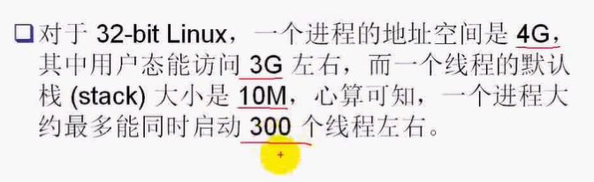

## 多线程能提高并发度吗

## 多线程能提高吞吐量吗
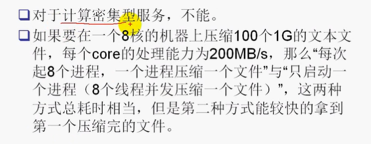

## 多线程如何让 I/O 和计算重叠
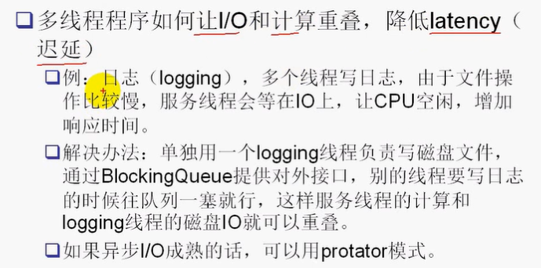

## 线程池的大小如何选择
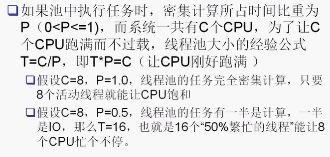

## 线程分类

