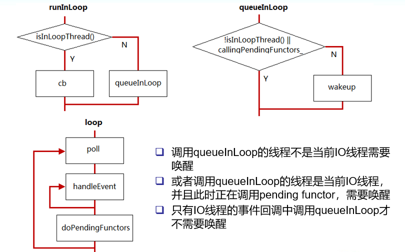
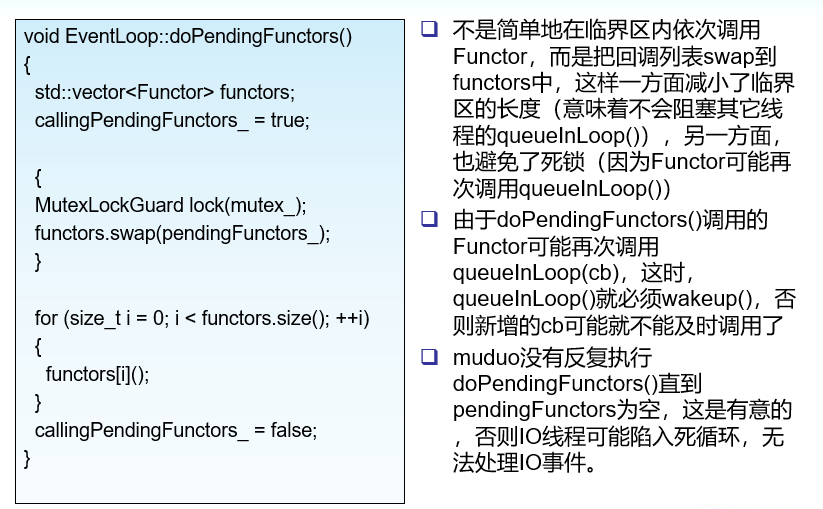

## 进程(线程)wait/notify
 - pipe
 - socketpair   可以用于双向通信
 - eventfd
 - eventfd 是一个比 pipe 更高效的线程间事件通知机制，一方面它比 pipe 少用一个 file descripor，节省了资源；另一方面，eventfd 的缓冲区管理也简单得多，全部“buffer” 只有定长8 bytes，不像 pipe 那样可能有不定长的真正 buffer。

## EventLoop::runInLoop
```c++
// 在I/O线程中执行某个回调函数，该函数可以跨线程调用
void EventLoop::runInLoop(const Functor& cb)
{
  if (isInLoopThread())
  {
    // 如果是当前IO线程调用runInLoop，则同步调用cb
    cb();
  }
  else
  {
    // 如果是其它线程调用runInLoop，则异步地将cb添加到队列
    queueInLoop(cb);
  }
}
```

## EventLoop::queueInLoop
```c++
void EventLoop::queueInLoop(const Functor& cb)
{
  {
  MutexLockGuard lock(mutex_);
  pendingFunctors_.push_back(cb);
  }
  // 调用queueInLoop的线程不是当前IO线程需要唤醒
  // 或者调用queueInLoop的线程是当前IO线程，并且此时正在调用pending functor，需要唤醒
  // 只有当前IO线程的事件回调中调用queueInLoop才不需要唤醒
  if (!isInLoopThread() || callingPendingFunctors_)
  {
    wakeup();
  }
}
```

## EventLoop::loop
```c++
while (!quit_)
  {
    activeChannels_.clear();
    pollReturnTime_ = poller_->poll(kPollTimeMs, &activeChannels_);
    if (Logger::logLevel() <= Logger::TRACE)
    {
      printActiveChannels();
    }
    eventHandling_ = true;
    for (ChannelList::iterator it = activeChannels_.begin();
        it != activeChannels_.end(); ++it)
    {
      currentActiveChannel_ = *it;
      currentActiveChannel_->handleEvent(pollReturnTime_);
    }
    currentActiveChannel_ = NULL;
    eventHandling_ = false;

    doPendingFunctors();     // 处理其它的任务
  }

```

## 流程图


## doPendingFunctors
