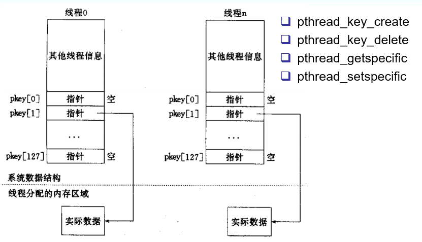

## 线程特定数据
 - 在单线程程序中，我们经常要用到"全局变量"以实现多个函数间共享数据。
 - 在多线程环境下，由于数据空间是共享的，因此全局变量也为所有线程所共有。 
 - 但有时应用程序设计中有必要提供线程私有的全局变量，仅在某个线程中有效，但却可以跨多个函数访问。
 - POSIX线程库通过维护一定的数据结构来解决这个问题，这个些数据称为（Thread-specific Data，或 TSD）。
 - 线程特定数据也称为线程本地存储TLS（Thread-local storage）
 - 对于POD类型的线程本地存储，可以用__thread关键字

