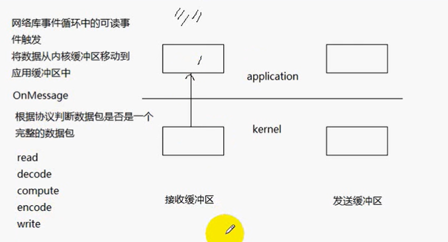
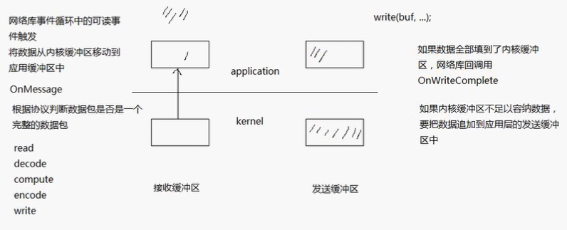

## TCP 网络编程的本质
###### TCP网络编程最本质是的处理三个半事件
 - 连接建立：服务器accept（被动）接受连接，客户端connect（主动）发起连接
 - 连接断开：主动断开（close、shutdown），被动断开（read返回0）
 - 消息到达：文件描述符可读
    
    
 - 消息发送完毕：这算半个。对于低流量的服务，可不必关心这个事件;这里的发送完毕是指数据写入操作系统缓冲区，将由TCP协议栈负责数据的发送与重传，不代表对方已经接收到数据。

## 什么都不做的 EventLoop
 - one loop 	per thread意思是说每个线程最多只能有一个EventLoop对象。
 - EventLoop对象构造的时候，会检查当前线程是否已经创建了其他EventLoop对象，如果已创建，终止程序（LOG_FATAL）
 - EventLoop构造函数会记住本对象所属线程（threadId_）。
 - 创建了EventLoop对象的线程称为IO线程，其功能是运行事件循环（EventLoop::loop）

