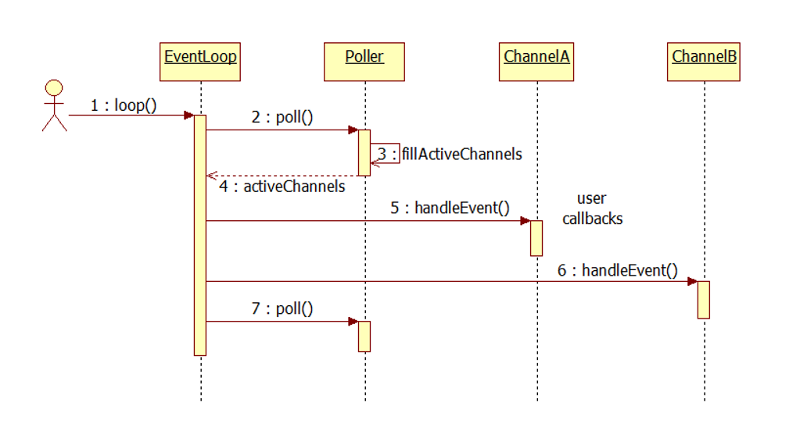
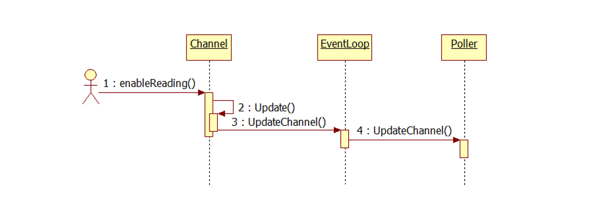

## Channel
 - Channel是selectable IO channel，负责注册与响应IO 事件，它不拥有file descriptor
 - Channel是Acceptor、Connector、EventLoop、TimerQueue、TcpConnection的成员，生命期由后者控制
###### 时序图



## 定时器函数选择
###### 定时函数，用于让程序等待一段时间或安排计划任务：
 - sleep 
 - alarm 
 - usleep 
 - nanosleep 
 - clock_nanosleep 
 - getitimer / setitimer 
 - timer_create / timer_settime / timer_gettime / timer_delete 
 - timerfd_create / timerfd_gettime / timerfd_settime

###### timerfd_* 入选的原因
 - sleep / alarm / usleep 在实现时有可能用了信号 SIGALRM，在多线程程序中处理信号是个相当麻烦的事情，应当尽量避免
 - nanosleep 和 clock_nanosleep 是线程安全的，但是在非阻塞网络编程中，绝对不能用让线程挂起的方式来等待一段时间，程序会失去响应。正确的做法是注册一个时间回调函数。 
 - getitimer 和 timer_create 也是用信号来 deliver 超时，在多线程程序中也会有麻烦。
 - timer_create 可以指定信号的接收方是进程还是线程，算是一个进步，不过在信号处理函数(signal handler)能做的事情实在很受限。 
 - timerfd_create 把时间变成了一个文件描述符，该“文件”在定时器超时的那一刻变得可读，这样就能很方便地融入到 select/poll 框架中，用统一的方式来处理 IO 事件和超时事件，这也正是 Reactor 模式的长处。

###### API
```c++
#include <sys/timerfd.h>

int timerfd_create(int clockid, int flags);

int timerfd_settime(int fd, int flags, const struct itimerspec *new_value, struct itimerspec *old_value);

int timerfd_gettime(int fd, struct itimerspec *curr_value)
```
