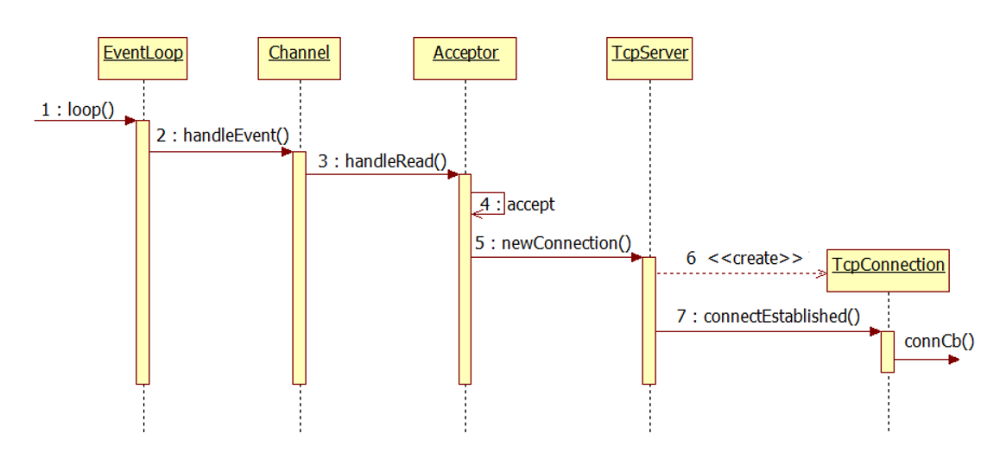

## TcpServer/TcpConnection
 - Acceptor类的主要功能是socket、bind、listen
 - 一般来说，在上层应用程序中，我们不直接使用Acceptor，而是把它作为TcpServer的成员
 - TcpServer还包含了一个TcpConnection列表
 - TcpConnection与Acceptor类似，有两个重要的数据成员，Socket与Channel

## 时序图
