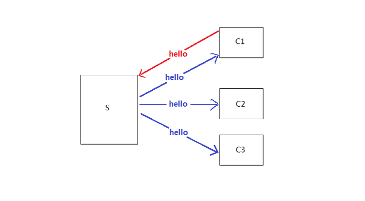
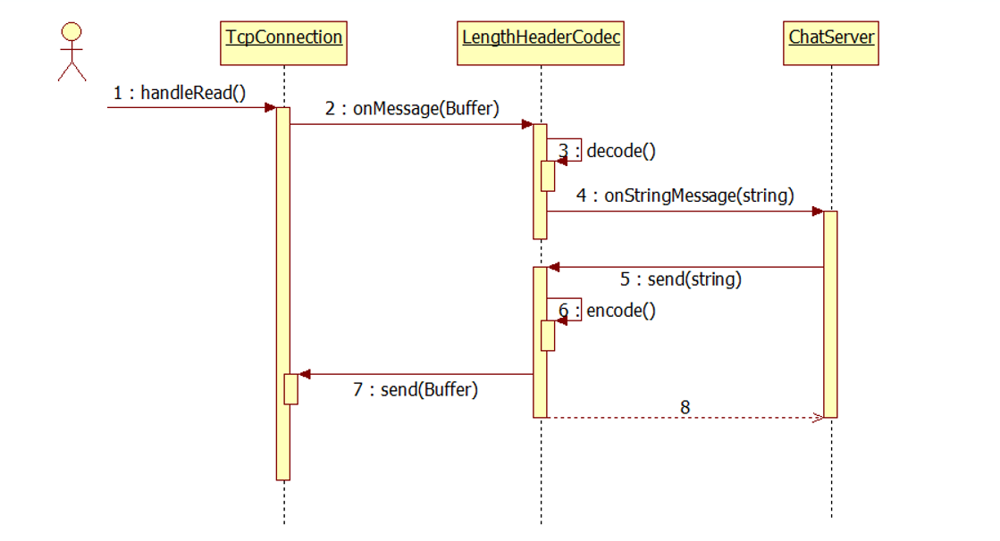
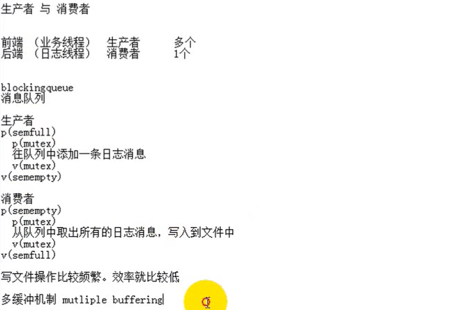

## 五个简单 TCP 协议 simle/
 - discard - 丢弃所有收到的数据；
 - daytime - 服务端 accept 连接之后，以字符串形式发送当前时间，然后主动断
开连接；
 - time - 服务端 accept 连接之后，以二进制形式发送当前时间（从 Epoch 到现在
的秒数），然后主动断开连接；我们需要一个客户程序来把收到的时间转换为字
符串。
 - echo - 回显服务，把收到的数据发回客户端；
 - chargen - 服务端 accept 连接之后，不停地发送测试数据。

## muduo 库网络模型使用示例（sudoku 求解服务器 MuduoManual.pdf P35）
 - reactor（一个IO线程）
 - multiple reactor （多个IO线程）
 - one loop per thread + thread pool （多个IO线程 + 计算线程池）

## 文件传输（MuduoManual.pdf P57）
 - examples/filetransfer/download.cc
 - examples/filetransfer/download2.cc
 - examples/filetransfer/download3.cc
 - tests/Filetransfer_test.cc

## 聊天服务器（MuduoManual.pdf P66）
 - examples/asio/chat/server.cc 单线程
 - examples/asio/chat/server_threaded.cc，多线程 - TcpServer，并用mutex来保护共享数据mutex
 - examples/asio/chat/server_threaded_efficient.cc,借shared_ptr实现copy-on-write的手法来降低锁竞争
 - examples/asio/chat/server_threaded_highperformance.cc，采用thread local变量实现多线程高效转发

###### 消息格式
 - 消息分为包头与包体，每条消息有一个4字节的头部，以网络序存放字符串的长度。包体是一个字符串，字符串也不一定以’\0’结尾。比方说有两条消息"hello"和"chenshuo"，那么打包后的字节流是：
 - 0x00,0x00,0x00,0x05, 'h','e','l','l','o',0x00,0x00,0x00,0x08,'c','h', 'e','n','s','h','u','o'
 - 共21字节。

###### 借shared_ptr实现copy on write
 - shared_ptr是引用计数智能指针，如果当前只有一个观察者，那么引用计数为1,可以用shared_ptr::unique()来判断
 - 对于write端，如果发现引用计数为1，这时可以安全地修改对象，不必担心有人在读它。
 - 对于read端，在读之前把引用计数加1，读完之后减1，这样可以保证在读的期间其引用计数大于1，可以阻止并发写。
 - 比较难的是，对于write端，如果发现引用计数大于1，该如何处理?既然要更新数据，肯定要加锁，如果这时候其他线程正在读，那么不能在原来的数据上修改，得创建一个副本，在副本上修改，修改完了再替换。如果没有用户在读，那么可以直接修改。

## 测量两台机器网络延迟——RTT（MuduoManual.pdf P119）
 - NTP 是网络时间同步协议
 - 用来同步客户端与服务端的时钟
 - RTT = （T4 - T1）-（T3 - T2）
 - T1 + RTT/2 = T2 + offset (offset 是指客户端与服务器端的时间差)
 - 如果客户端的时钟快了，则 offset 为正
 - offset = T1 - T2 + RTT/2 = T1 - T2 + ((T4 - T1) - (T3 - T2))/2
          = ((T4 + T1) - (T2 + T3)) / 2
###### muduo设计的 roundtrip
 - RTT = T3 - T1
 - T1 + RTT/2 = T2 - offset（offset 是指服务器端与客户端的时间差）
 - offset = T2 - T1 - RTT/2 = T2 - T1 - (T3 - T1) / 2 = T2 - (T1 + T2) / 2

## 限制服务器最大并发连接数（MuduoManual.pdf P108）
## 用Timing wheel踢掉空闲连接（MuduoManual.pdf P122）
## 高效率多线程异步日志
 - 线程安全，即多个线程可以并发写日志，两个线程的日志消息不会出现交织。
    用一个全局的mutex保护IO
    每个线程单独写一个日志文件
 - 前者造成全部线程抢占一个锁
 - 后者有可能让业务线程阻塞在写磁盘操作上。
 - 用一个背景线程负责收集日志消息，并写入日志文件，其他业务线程只管往这个“日志线程”发送日志消息，这称为“异步日志”。

