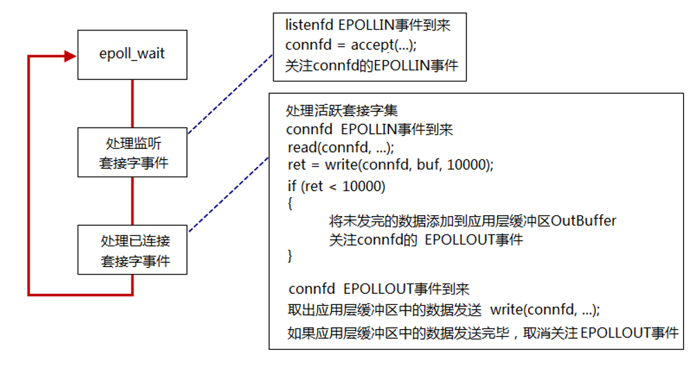
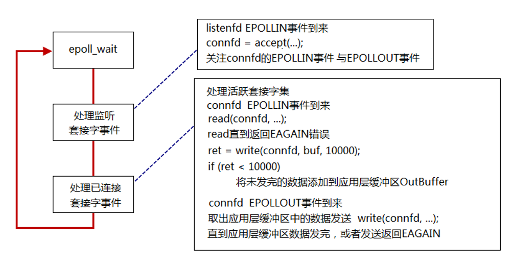

## EPOLLIN 事件
 - 内核中的 socket 接收缓冲区   为空   低电平
 - 内核中的 socket 接收缓冲区  不为空  高电平

## EPOLLOUT 事件
 - 内核中的 socket 发送缓冲区不满   高电平
 - 内核中的 socket 发送缓冲区满     低电平

## LT电平触发
 - 高电平触发
  
  当内核中的接收缓冲区为空时，处于低电平，不会触发任何事件，所以在开始监听此事件
  当内核中的发送缓冲区为空时，处于高电平，会触发EPOLLOUT事件，只要未满，就会一直触发事件【TIME-WAIT】，所以在开始不用监听事件
  当内核中的接收缓冲区开始接收数据时，处于高电平，触发EPOLLIN事件，只要接收缓冲区中有数据，就一直会触发EPOLLIN事件
  所以不用担心读内核接收缓冲区中的数据
  当要往内核发送缓冲区中写数据的时候，有可能会写满，但是还没写完，所以要监听内核套接字的EPOLLOUT事件，因为内核缓冲区不满就会触发这个事件，只要有这个事件发生，就写，直到写完
  当写完之后，就取消关注 EPOLLOUT 事件

## ET 边沿触发
 - 低电平 -> 高电平 触发
 - 高电平 -> 低电平 触发
    
    因为只有状态改变才会发出事件，所以可以两个都监听上
    当发送缓冲区有数据，状态改变了，发送EPOLLIN事件
    一直读，直到返回EAGAIN错误
    当发送数据将内核缓冲区填满，状态改变了，发送EPOLLOUT事件，当内核缓冲区由满到不满，也会发送EPOLLOUT事件

## 总结
 - 当缓冲区中有数据时，为高电平
 - EPOLLIN  空 是低
 - EPOLLOUT 满 是低
 - LT 有数据的时候就会触发
 - ET 在状态转变的时候会触发
 - 文件描述符都在内核

## select、poll、epoll对比

