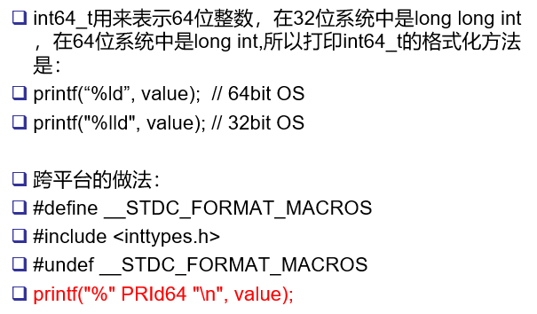

## Timestamp.{h, cc}  ————  UTC 时间戳

## muduo::copyable
 - 值语义：可以拷贝的，拷贝之后，与原对象脱离关系
 - 对象语义：要么就是不能拷贝的，要么可以拷贝拷贝之后与原对象仍然存在一定的关系，比如共享底层资源（要实现自己的拷贝构造函数）
 - muduo::copyable 是空基类，表示类，值类型

## boost::less_than_comparable<Timestamp>
 - 如果实现了 < 操作符，可自动实现 >, <=, >=

## 代码解析
 - 时间起始点
    1970-01-01 00:00:00
    1970-01-02 00:00:00     86400 秒来表示

## 使用 PRId64
