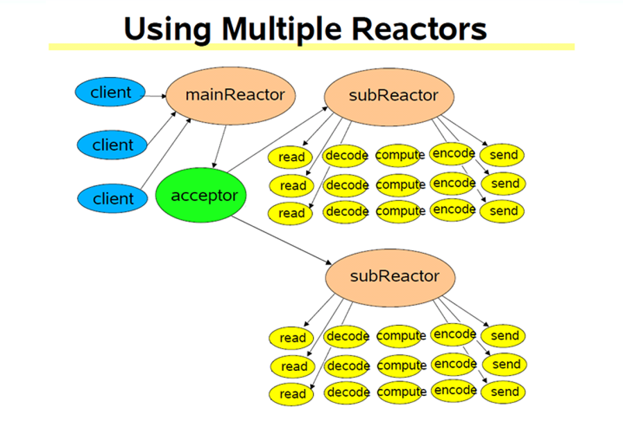

## MUDUO
 - muduo库如何支持多线程
 - EventLoopThread（IO线程类）
 - EventLoopThreadPool（IO线程池类）
IO线程池的功能是开启若干个IO线程，并让这些IO线程处于事件循环的状态

## 文件描述符的使用状况
 - 0，1，2
 - 3 pollerFd
 - 4 timerFd
 - 5 wakeupFd
 - 6 listenFd
 - 7 idleFd
